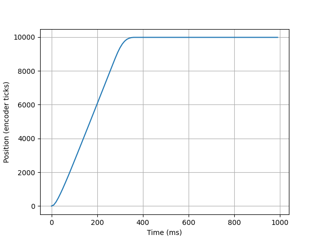
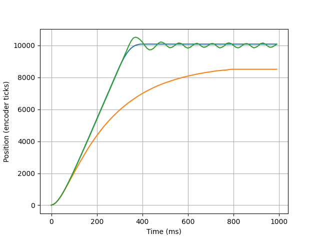
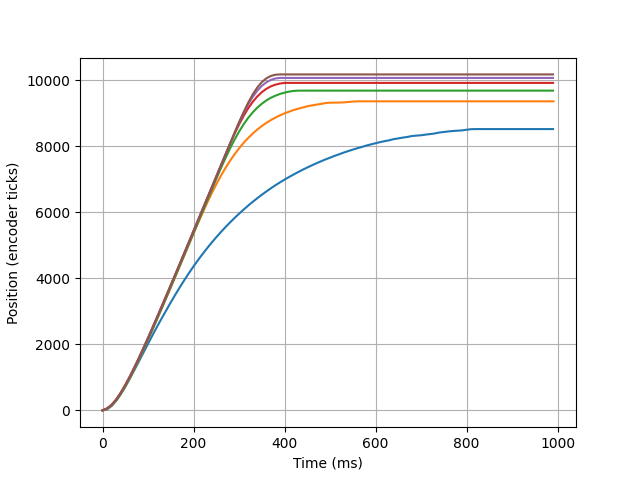

## ME 405 Lab 3

### Authors
By: Jack Krammer, Jason Chang

California Polytechnic State University

February 20, 2024

### Description
This lab was beneficial in increasing our understanding in many areas. We 
implemented closed-loop control and visualized the response in an interactive
GUI. The closed-loop control utilized a proportional controller to sense a 
motor encoder reeader and acutate a motor. The GUI utilized Tkinter to interact
with the user and plot data.

First, we designed a proportional controller class to provide closed-loop control 
for a DC motor and connected encoder reader. This class was written such that it could
be applied to a generic closed-loop control situation with arbitrary acutators 
and sensors. These are easily implemented by passing the proportional controller
class the respective actuate and sense functions. This class utilized queues to 
keep track of position and time data if this functionality is desired. 

Next, we 
created a main.py file to apply this closed-loop control to the DC motor in our 
lab kit with user defined control gain values (in the documentation this value 
is commonly referred to as the Kp value). 

Lastly, we implemented a GUI for users to interact with and perform closed-loop
control tests with desired control gain values.

### Hardware
The hardware provided in the ME 405 lab kit should be constructed to satisfy the 
following:

Expected pin setup:
    Motor
        PC1 = enable pin (internal with the L6206)
        PA0 = motor input 1 (internal with the L6206)
        PA1 = motor input 2 (internal with the L6206)
    Encoder
        PC6 = encoder input A
        PC7 = encoder input B

Motor wire connections:
    Blue	    Encoder channel B
    Yellow	    Encoder channel A
    Red	        Encoder 5V supply (should be connected to the 3.3V output)
    Black	    Encoder ground
    Orange	    Motor power (for the motor B + connection on the L6206)
    Green	    Motor power (for the motor B - connection on the L6206)
    (None)	    No connection

### Results
For all step responses, the target set point (aka motor position) was 10,000.
Various control gains were tested and the optimal control gain was 
experimentally found to be 0.06 when there was no load and 0.05 when the 
flywheel was attached. 

The closed-loop controller reads data from the motor encoder and actuates the 
DC motor from the provided ME 405 lab kit. 

After initial testing of the control gain values, the optimal order of 
magnitude was narrowed down within the range [0.01, 1]. Any control gain value
less than 0.01 would provide slow and very underdamped responses. Any control 
gain value of 1 or greater caused an overdamped response. 

As depicted in figure 3, as the control gain increased from 0.01 to 0.06, the 
step response became more optimal. However, as the control gain increased beyond 
0.05, the resulting set point (position) of the motor increased past the target
of 10,000. As the control gain increased even further, the step response became
overdamped. This overdamped response is illustrated in figure 2 by the green 
line represnting a control gain of 2.0.

Figure 1. Step response for a motor with no load and a control gain of 0.06.

Figure 2. Step responses for the motor with a flywheel load and control gains
resulting in underdamped, overdamped, and optimal responses. The orange line 
illustrates an underdamped response from a control gain of 0.01. The green 
line illustrates an overdamped response from a control gain of 2.0. The blue 
line illustrates the best response obtained. This optimal response was due 
to a control gain of 0.05.

Figure 3. Step responses illustrating the process of finding the optimal 
control gain for the motor with the flywheel. From the bottom up: the blue 
line is the step response to a control gain of 0.01; the orange line 
corresponds to a control gain of 0.02; the green line a control gain of 0.03; 
the red line a control gain of 0.04; the bottom purple line a control gain of 
0.05; and the top purple line a control gain of 0.06.

